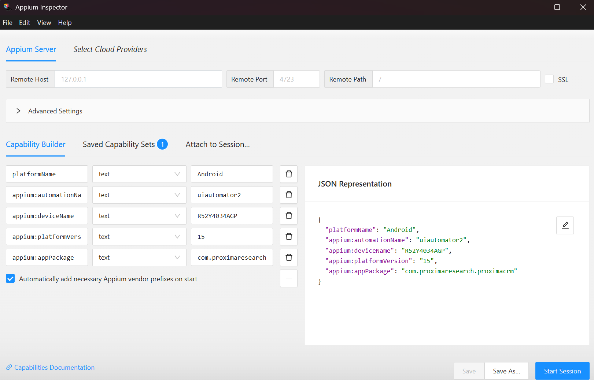

# Proxima_Android

1. Скачати та встановити Node JS https://nodejs.org/
2. Після клонування репозиторія відкрити термінал та зробити npm install
3. Cпробуй в терміналі зробити команду appium, якщо appium не знайдено то зроби команду npm install -g appium. Після завершення встановлення спробуй appium знову.
4. Після ініціалізації Appium ти отримаєш в терміналі повідомлення про You can provide the following URLs in your client code to connect to this server:
   http://192.168.0.100:4723/ - якщо в тебе інший URL -> дай знати.

5. !ВАЖЛИВО, щоб ранити тести саме на твоєму девайсі тобі все одно потрібно налаштовувати capabilities твого девайса наприклад, як приклад ти зможеш подивитися у файлі проекту wdio.android.conf.ts
   capabilities: [
   {
   // capabilities for local Appium web tests on an Android Emulator
   platformName: 'Android', -> Твоя версія платформи
   'appium:deviceName': 'R52Y4034AGP', -> Твій Device Name, ти зможеш отримати його через термінал команду adb devices ( як це зробити я опишу нижче )
   'appium:platformVersion': '15', -> Версія твого Android
   'appium:automationName': 'UiAutomator2', -> це Engine автоматизації
   'appium:appPackage': 'com.proximaresearch.proximacrm', -> назва апки яка буде запускатись при автоматизації ( як це отримати я опишу нижче )
   },
   ],

6. Ранити тести через команду в терміналі npm run + твій греп наприклад npm run testloginregressionandroid, грепи та список скріптів для рана можна подивитись у package.json

"scripts": {
"testloginregressionandroid": "wdio run wdio.android.conf.ts --spec ./test/specs/_.ts --mochaOpts.grep='regression'",
"testloginregressionios": "wdio run wdio.ios.conf.ts --spec ./test/specs/_.ts --mochaOpts.grep='regression'",
"allure:generate": "allure generate allure-results --clean -o allure-report",
"allure:open": "allure open allure-report"
},

Як налаштувати Appium Inspector.

1. Скачати Appium Inspector https://github.com/appium/appium-inspector/releases та вибрати свою ОСЬ
2. Встановити Java SDK https://www.oracle.com/java/technologies/downloads/
3. Встановити Android SDK + Platform Tools https://developer.android.com/studio?hl=ru#cmdline-tools
4. Налаштувати Path до твого встановленного Platform Tools
5. Включити Developer Mode на твоєму девайсі
6. Включити USD Debug на твоєму девайсі
7. Через СMD або інший термінал зробити команду adb devices та підтвердити на своєму девайсі, якщо все правильно працює то ти отримаєш щось типу ( R52Y4034AGP device) - де R52Y4034AGP це і є твій appium:deviceName
8. Щоб отримати список встановленних аплікацій на твоєму девайсі зроби команду в терміналі adb shell pm list packages або adb shell pm list packages | findstr proxima -> це покаже всі твої пакети де є назва proxima

Як налаштувати щоб Appium Inspector показував твою апку з селекторами

1. В терміналі зробити команду appium
2. Відкрити Appium Inspector та налаштувати Capability Builder наприклад . Дивись Пункт 5 ( !ВАЖЛИВО, щоб ранити тести саме на твоєму девайсі тобі все одно потрібно налаштовувати capabilities )
3. Натиснути Start Session button
4. Якщо все зроблено правильно то ти отримаєш скрін з proxima crm
